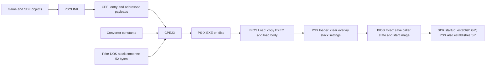

# Executable byte provenance: native link, converter leakage and retail tails

This is the single evidence record for the native PSX link, the preserved
CPE2X bug, retail header/tail differences, converter experiments and the
on-disc date window. Build commands and current overlay-link status live in
[the executable build guide](../executable-linking.md).

The native PSX build reproduces all 560 initialized code/data bytes. Its
4096-byte EXE differs from retail in 59 header bytes and seven tail bytes.
Of the header differences, 52 are uninitialized local-storage bytes written
by the preserved CPE2X 1.3 used here. The other seven lie outside its final
header-structure write. Retail suggests a similar host-memory leak, but the
exact retail converter and process remain unidentified.

## Native PSX build and evidence boundary

Use the existing exact C source and the original library archives. Feed the
compiler's assembly directly to ASPSX, its object directly to PSYLINK, and
PSYLINK's CPE directly to CPE2X. Retain remaining file differences. No injected
padding, copied retail header, ELF section adjustment or library object-format
conversion is part of executable generation.

PSX `main` is 208 bytes at `80010028`, with fifteen text relocation sites.
Its C unit also owns two 20-byte path arrays and an 8-byte two-pointer table.
The seven SDK text members and SDK stack-size datum are library inputs, not
reconstructed game functions. The C source and SDK/API types are unchanged.

### Preserved tools and ordinary commands

The compiler is the pinned GCC 2.5.7 PSX rebuild, using the existing `-O2 -G0
-mcpu=r2000` profile. The preserved ASPSX binary used by upstream's assembler
[test suite](https://github.com/mkst/maspsx/tree/746b895f02929ecd148af7b1f4ff05b69f973878/aspsx)
identifies itself as 1.07 and runs under DOSBox-X. Its SHA-256 is:

```text
83cfea6712cc444780614b111db6d5cf6046bb25d5070c734a8ae967641050c5
```

The flake pins the upstream assembler archive by SHA-256 and extracts only
this binary. It differs from the Release 2.5 media copy of ASPSX,
which stopped with a software-key/network-manager error. The exact protection
mechanism in that copy was not established. The working binary's historical
use by FromSoftware remains unproved; no modification is applied to it here.

The compiler writes Unix line endings. ASPSX's DOS text reader requires CRLF,
so file line endings are changed; all directives, instructions, labels and
literal contents pass through unchanged. ASPSX produces LNK v2 directly.
The PSX command file is ordinary linker input:

```text
        org $80010000
        include "U0000.OBJ"
        inclib "LIBSN.LIB"
        inclib "LIBAPI.LIB"
bssdata group bss
        section .sbss,bssdata
        section .bss,bssdata
        regs pc=__SN_ENTRY_POINT
```

The original tools then run:

```text
aspsx -G0 -o U0000.OBJ U0000.S
psylink /c @LINK.LNK,PSX.CPE,PSX.SYM,PSX.MAP
cpe2x PSX.CPE
```

No library-member extraction order is supplied. Native PSYLINK selects and
places the original members through its own archive processing. No post-link
operation modifies its CPE or CPE2X's EXE.

### Exact initialized PSX bytes

The native map is:

| Range | Contents | Bytes |
| --- | --- | ---: |
| `80010000–80010028` | Compiled C path arrays | 40 |
| `80010028–800100f8` | Compiled C `main` | 208 |
| `800100f8–80010224` | Original SDK text | 300 |
| `80010224–8001022c` | Compiled C pointer table | 8 |
| `8001022c–80010230` | SDK stack-size word | 4 |
| `80010230–80010234` | SDK uninitialized `.sbss` | 4 |

All 560 initialized bytes agree with retail at their actual addresses.
The source's `.align 2` directives become native LNK alignment tag 8, which
PSYLINK's independent controls establish as four-byte alignment. No GNU ELF
minimum or section-renaming workaround affects this path.

The BSS group was added while enabling the overlay links. It makes the native
CPE contain only the 560 initialized PSX bytes: the SDK's four `.sbss` bytes
still receive addresses but no load record. The resulting EXE still differs
in 66 bytes. The detailed converter experiments below used the earlier
recorded control command without that group; their hashes, raw header values
and input snapshots describe those runs, rather than a regenerated output.

## Finding: uninitialized memory in the preserved converter

**Proved in our build:** the unchanged, preserved CPE2X 1.3 DOS executable
used by this repository writes 52 uninitialized local-storage bytes into the
EXE header. This is a bug in that historical converter binary, not in the
repository's Python build driver or reconstructed game code. It does not
establish that FromSoftware used this exact CPE2X binary.

**Inferred for retail:** fragments of converter diagnostic text and linker
symbol listings in the retail headers strongly suggest a similar disclosure
of earlier host-memory contents. The exact retail producer, allocation and
memory history have not been recovered. The additional CPE fragment at
`88–8f` cannot be produced by the proved stack leak alone on the reviewed
path through our converter. Do not report the retail converter as identified
or its stack bug as directly reproduced.

The complete-execution controls below further narrow our converter's case:
all 52 positions are last written by its own C runtime during CPE processing,
before the header object is allocated. Replaying the linker first does not
preserve its symbol text in those positions. Several leaked words are actual
return addresses from the converter's own calls.

Here, "stack" means memory on the DOS development PC while converting CPE
to EXE. At `3250–3253`, the converter executes `push bp; mov bp, sp;
sub sp, 0x8c`. This reserves 140 bytes for local storage without clearing
them. The 136-byte header occupies `SS:[BP-8c]` through `SS:[BP-5]`.
Adjusting SP, popping a value, or returning from a call does not erase old
memory. Fields the routine never assigns therefore retain earlier contents,
which its whole-structure file write copies to disc. Once written, those
bytes are fixed file contents; they do not change on each game launch.

Use **uninitialized-memory disclosure in CPE2X** as the precise finding.
"Tooling UB" is informal shorthand: the original C source is unavailable,
and the machine-code experiment does not settle the language-lawyer status
of copying an object's uninitialized representation. It directly proves
that output depends on bytes the header routine never initializes.

### Consequence for game behavior and reconstruction

No gameplay effect from these 52 initial byte values has been identified in
the reviewed loading/startup paths. Reserved fields and title residue have
no identified consumer; BIOS replaces the saved-register slots; startup
replaces the initial GP; and the PSX loader clears GAME/OPEN stack settings
before `Exec`. PSX startup establishes its own SP. The consumer audit below
records these separately because some affected fields are meaningful launch
parameters, not universally unused padding.

This is a code-based conclusion, not a completed altered-header boot test
or a trace of every boot-firmware path. A behavioral control would vary only
these bytes in disposable EXEs, retaining the entry, load extent and payload,
then compare boot and overlay transitions under the same BIOS.

These differences should remain separate from game-code mismatches. They
still prevent whole-file byte identity: reproducing the original tool's
logical inputs alone need not reproduce its leftover memory. Historical
reproduction requires the producer and relevant memory history; preserving
retail bytes would instead be an explicit output policy, not evidence that
the original process was recovered. The current build does not apply such
a policy. The isolated two-fill control below proves the write mask only.

## Exact PSX comparison

Offsets are hexadecimal **file offsets**, with no PlayStation virtual address.
Hex pairs below are in file order, not reversed into numeric word values.
The candidate is the unchanged native build recorded in `build/link/psx/comparison.json`.

| Offset | SDK field | Retail bytes | Candidate bytes | Differences |
| --- | --- | --- | --- | ---: |
| `08–0b` | `XF_HDR.text`, reserved | `a2 33 dc ff` | `16 05 a8 00` | 4 |
| `0c–0f` | `XF_HDR.data`, reserved | `52 ff 63 6f` | `5c 0f 70 1d` | 4 |
| `14–17` | `EXEC.gp0`, initial GP | `74 20 66 72` | `cc 05 7e ef` | 4 |
| `30–33` | `EXEC.s_addr`, stack base | `66 61 6b 65` | `06 00 7e ef` | 4 |
| `34–37` | `EXEC.s_size`, stack offset | `08 43 48 52` | `5c 0b cc 05` | 4 |
| `38–3b` | `EXEC.sp`, saved SP | `5f 46 49 4c` | `cc 05 b4 00` | 4 |
| `3c–3f` | `EXEC.fp`, saved FP | `45 54 00 00` | `cc 05 96 0f` | 4 |
| `40–43` | `EXEC.gp`, saved GP | `00 00 00 00` | `b0 1c 52 4a` | 4 |
| `44–47` | `EXEC.ret`, saved return address | `0a 00 08 00` | `40 14 06 9f` | 4 |
| `48–4b` | `EXEC.base`, saved R16 | `04 00 00 00` | `ff 9f 40 14` | 4 |
| `7c–87` | Unwritten end of `XF_HDR.title[60]` | `04 02 00 00 04 02 19 13 00 02 ea 01` | `05 00 ca 0f 8e 15 22 08 05 00 fe 04` | 12 |
| `88–8f` | Sector padding after `XF_HDR` | `43 50 45 01 08 00 03 90` | `00 00 00 00 00 00 00 00` | 7 |

The fields that carry the image placement already agree:

| Offset | Meaning | Value in both PSX files | Candidate source |
| --- | --- | --- | --- |
| `00–07` | Format signature | `PS-X EXE` | Converter literal |
| `10–13` | Entry point | `80010100` | Four CPE bytes at offsets `09–0c` |
| `18–1b` | Load address | `80010000` | Lowest sorted CPE load-record address |
| `1c–1f` | Load size | `00000800` | Output body extent rounded to 2048 bytes |
| `20–27` | Separate data address/size | Both zero | Explicit converter stores |
| `28–2f` | BIOS memory-clear address/size | Both zero | Explicit converter stores |
| `4c–7b` | Identification string, including NUL | `Sony Computer Entertainment Inc. for Japan area` | Converter literal and `strcpy` |

`KERNEL.H` in the pinned SDK defines `struct EXEC` as fifteen 32-bit words,
and `struct XF_HDR` as an eight-byte key, two words, that execution structure,
and a 60-byte title. Its extent is `88` bytes. The sector header is `800`
bytes; those are different extents.

## Who writes the bytes

The pinned converter has SHA-256
`8ee3df02d30d9269bba8c570d69f3c9d2b59aff98af0fbf796367526bc02ef20`.
Its DOS load image starts at file offset `400`; the instruction offsets in
this section are relative to that image, not to a PS-X executable.

1. CRT startup at `00ae–00bf` clears global storage, including the 2048-byte
   buffer at `DS:ef7e`.
2. The CPE reader at `2daa` reads the first nine CPE bytes into that buffer,
   then reads the four-byte entry into `DS:f786`. It collects and sorts load
   records, sets the lowest address in `DS:f782`, and writes the initial
   2048-byte header buffer at `2f70`.
3. The body writer copies CPE payload bytes and inserts zeros for gaps. It
   clears the global buffer again before final page padding and stores the
   rounded body size in `DS:f77e` at `31f4–31f7`.
4. The final header routine at `3250` allocates a stack frame containing
   `XF_HDR`. It assigns only the entry, load address/size, four zero fields,
   signature, and identification string. It does **not** clear the structure.
   The routine reopens the output and writes all `88` structure bytes at
   `337c`, including 52 bytes it never assigned.
5. Bytes `88–7ff` retain the zero values from the first pass. Consequently,
   prior DOS stack contents alone cannot explain retail's fragment at `88`
   with this exact binary and its ordinary supported input path.

The effective header-construction logic is:

```c
/* Semantic sketch of the host tool, not reconstructed game source. */
struct XF_HDR header;                 /* not initialized */
header.exec.pc0 = cpe_entry;
header.exec.t_addr = lowest_load_address;
header.exec.t_size = rounded_body_size;
header.exec.d_addr = header.exec.d_size = 0;
header.exec.b_addr = header.exec.b_size = 0;
memcpy(header.key, "PS-X EXE", 8);
strcpy(header.title, "Sony Computer Entertainment Inc. for Japan area");
fwrite(&header, sizeof(header), 1, output_at_start);
```

This is why reserved words, unused title bytes, and BIOS save slots appear
in the file: the converter writes a complete structure rather than just the
fields it initialized. In the candidate, the particular values are prior
host stack contents. They are not supplied as GP/stack settings by PSYLINK.



The diagram's overlay route applies to GAME/OPEN. PSX itself is started by
the boot firmware; its entry then initializes the runtime and runs the loader.

## Retail clues about earlier contents

All three retail headers preserve `co` at `0e–0f` and `t fr` at `14–17`.
The pinned converter contains `convert from %s to %s` at DOS file offset
`388d`. Placing `convert from ` at header offset `0e` would leave exactly
those two fragments after the entry and load-address stores overwrite the
intervening bytes. This supports a converter diagnostic-buffer origin;
the historical pointer and copy path are not recovered.

At `30–4b`, the retail images retain different content:

| Image | Retained content | Independent evidence |
| --- | --- | --- |
| PSX | `fake`, then a length-like `08`, then `CHR_FILE`, followed by binary data | Resembles symbolic/type information. Neither the name's owner nor its original record format is established; no occurrence was found in the retained candidate tool, library, or header bundle. |
| GAME | `94C  TransposeMatrix\r\n 80050` | The curated SDK match places `TransposeMatrix` at `8004e94c`; the address suffix agrees. |
| OPEN | `_96_remove\r\n 8001C4D8  _96_v` | The curated SDK match places `_96_vec` at `8001c4d8`; this is the beginning of its symbol-listing row. |

The GAME/OPEN fragments strongly support linker symbol-listing text as
earlier contents of the memory eventually written into the header. That
does not mean CPE2X intentionally reads a MAP file: the reviewed conversion
path opens only the named CPE and its derived EXE. Reuse of memory containing
earlier linker output is a candidate route, not a reproduced historical event.

All three images also share the exact twelve bytes at `7c–87` and the CPE
fragment at `88–8f`. The twelve bytes have no assigned semantic owner yet.
The latter is the beginning of a CPE file (`CPE`, format byte, unit record,
then the beginning of a register record), not a PlayStation instruction or
address. Its location is not produced by the current converter's write path.

## Who uses the fields on PlayStation

The BIOS [Load/Exec behavior](https://psx-spx.consoledev.net/kernelbios/#bios-file-execute-and-flush-cache)
distinguishes the header sector from the execution structure. `Load` copies
file bytes `10–4b` into an `EXEC` buffer and loads the body using `t_addr`
and `t_size`. `Exec` uses `pc0`, `gp0`, memory-clear fields and stack fields;
it overwrites the five saved-register words with the caller's live state.

| Fields | Consumer and consequence in this game |
| --- | --- |
| `text`, `data` at `08–0f` | Outside the copied `EXEC` range; not used for body placement. |
| `pc0`, `t_addr`, `t_size` | BIOS loader/launcher uses these to place and start the image. They already match. |
| `gp0` | BIOS `Exec` loads it into GP, but every retail entry establishes its own GP before game code uses it: PSX at `80010188/8c`, GAME at `8003ac5c/60`, OPEN at `8001aa7c/80`. |
| `d_addr`, `d_size` | Separate data fields remain zero; the whole addressed payload is covered by the main load extent. |
| `b_addr`, `b_size` | BIOS memory-clear description is zero. PSX SDK startup separately clears its own BSS at `80010100–120`. |
| `s_addr`, `s_size` | For GAME/OPEN, PSX `main` explicitly zeros both after `Load` and before `Exec`: `80010080/88` and `800100c0/c8`. Their on-disc text fragments therefore do not select the overlay stack. PSX startup establishes its own SP at `80010154` before its first stack-dependent call. |
| Saved `sp`, `fp`, `gp`, `ret`, `base` | BIOS `Exec` overwrites the in-memory slots before using them to restore the caller. Their on-disc values are not saved game state. |
| Title and sector padding | Outside the `EXEC` copy; no reviewed game loader consumer uses the trailing residue. The readable identification string is converter metadata. |

## CPE residue at initialized-data boundaries

`GAME.EXE` contains these bytes at virtual address `0x80057e68` (file offset
`0x46668`):

```text
43 50 45 01 08 00 03 90 00 00 00 00
```

They decode as the standard Psy-Q CPE v1 prefix: `CPE\x01`, select unit zero,
then the start of a 32-bit register-value record. The controlled PSYLINK 1.17
probe in `tests/psylink_order_smoke.py` now checks that every produced CPE has
the same six-byte magic/select-unit prefix. The bytes identify CPE-format
content in the final partially occupied PS-X EXE load page. Their producer
and the exact mechanism that placed them there remain unproved; the storage
classification below depends on object records and consumers, not the marker
alone.

This matters because referenced storage can begin inside that padded load
page. `player_update` treats `0x80057e68` and `0x80057e70` as signed motion
limits, writes both on every ordinary-update path before reading either, and
is their only referencing function. The two four-byte objects are eight bytes
apart, matching the old GCC/maspsx common allocation observed by the build
pipeline. They are therefore modeled as separate BSS objects even though their
addresses fall below the PS-X EXE header's page-rounded load end. All of their
references are confined to `player_update`, and file-static tentative BSS words
receive the observed eight-byte alignment in the pinned GCC/maspsx pipeline.
The source therefore defines both limits privately in `player_update.c` rather
than leaking declarations through a shared header.

Do not classify a referenced address as initialized source data merely because
it falls inside the page-rounded PS-X EXE payload. At a suspected tail
boundary, inspect the raw bytes, prove write-before-read behavior and xref
ownership, and compare the spacing with the compiler's common allocation.

OPEN has the same twelve-byte CPE prefix at `0x800375d8` (file offset
`0x25dd8`), followed by page zeros through its header load end `0x80037800`.
The private controller words at `0x80037760` and `0x80037768` are inside that
page, not initialized source data. Their consuming PAD routine overwrites
them before the first branch/call, and the supplied Sony PAD.OBJ records their
`.sbss` allocation separately from exported `PadIdentifier` in external BSS.
The [PAD review](../../config/evidence/pad_storage_and_linkage.md) corrects the
earlier zero-initializer and private-identifier assumptions. It does not promote
every zero in the page to a known allocation or silently flatten the two BSS
classes into a placeable section.

The [CD/resource storage review](../../config/evidence/cd_resource_bss.md)
provides another boundary control: OPEN's CdlLOC at `0x800375d8` overlaps the
four-byte CPE magic itself, but both CD helpers overwrite its three command
bytes before use. Retail cd_setloc copies only those three bytes, and CD_cw's
command-count table independently limits CdlSetloc to three. GAME's homolog
at `0x80057e80` has the same write-before-use behavior, including its separate
error-screen consumer. The real four-byte SDK type is retained, without an
explicit initializer. OPEN's nearby arena pointers are saved before their
scene/ending consumers restore them. This proves only the reviewed objects;
it does not classify every zero or gap following the CPE prefix.

### PSX tail ownership and consumers

PSX has the identical twelve-byte prefix at `0x80010230`, file offset `0xa30`,
immediately after the pointer table and SDK `_stacksize` word. Supplied
`LIBSN.LIB/SNMAIN.OBJ` allocates four uninitialized `.sbss` bytes there. The
retail startup zeros `[80010230, 80010234)` before using that slot to save
`$ra`; the bytes are not an initialized SDK datum. The following four bytes
remain an address-only census candidate, not a proved source allocation.
An original-object audit identifies both references to `80010234` as
`sectend(.bss)` expressions; neither establishes a four-byte initializer.

The concrete PSX reference trace is:

| Retail instructions | Reference and use |
| --- | --- |
| `80010100–80010120` | Clear `[80010230,80010234)` with `sw zero,0(v0)` before any read of that storage. |
| `80010180/80010184` | Store the incoming `$ra` at `80010230`. |
| `80010188/8001018c` | Set `$gp` to the section base `80010230`; this takes an address without reading its contents. |
| `8001019c/800101a0` | Read the previously saved `$ra` from `80010230`. |
| `80010108/8001010c` | Materialize `sectend(.bss) = 80010234` as the clearing loop's exclusive end. |
| `80010158/8001015c` and `80010198` | Derive the heap address from that same section end; the call delay slot adds four, passing `80010238` to `InitHeap`. |

`LIBSN.LIB/SNMAIN.OBJ` explicitly reserves four uninitialized bytes in
`.sbss`. Its patch expressions at text offsets `10/14` and `60/64` both
name `sectend(.bss)`. Four of the seven nonzero differing tail bytes occupy
the cleared word; the other three occupy the following boundary/gap word.
No reviewed PSX reference consumes either word's original CPE-prefix value.

## Controlled edits to CPE2X input

A separate experiment edits copies of `PSX.CPE`, runs the unchanged pinned
CPE2X in a fresh DOSBox process for each case, and compares each untouched EXE
with the complete retail file. Every case uses the same DOS filename and
command. The normal executable builder and its production CPE are unchanged.
Retail bytes deliberately supplied to these controls are not reconstructed
source data and are not banked.

| Input control | EXE bytes | Header differences | Body differences |
| --- | ---: | ---: | ---: |
| Original CPE and independent repeat | 4096 | 59 | 7 |
| Reverse or sort the load records | 4096 | 59 | 7 |
| Merge the initialized bytes into one record | 4096 | 59 | 7 |
| Split them into 1-, 4-, 16-, 64- or 256-byte records | 4096 | 59 | 7 |
| Explicitly load retail's twelve-byte tail prefix at `80010230` | 4096 | 59 | **0** |
| Explicitly supply the entire retail tail | 4096 | 59 | **0** |
| Supply the retail header as a load record at `8000f800`, plus the body/tail | 6144 | 62 | 2452 |

Appending a retail header after the CPE end record is an additional malformed
input control; it does not complete within the 60-second limit. The experiment
caps output-file sizes at 8 MiB. Thirteen conversions complete; none gives
complete-file equality. The best result has **59 differences**, all in the
header. Supplying the tail explicitly demonstrates input control over those
seven values, not historical reproduction of them.

Record edits do change some incidental header values: depending on the
control, 2–21 header bytes differ from the baseline output. The count of
differences from retail nevertheless remains 59 for every 4096-byte result.
All completed outputs retain eight zero bytes at header offsets `88–8f`,
where retail has `43 50 45 01 08 00 03 90`.

The [converter write trace](#who-writes-the-bytes) explains why supported
CPE records cannot populate header offsets `88–8f` through this writer.
Record ordering alone cannot explain those retail bytes.

The local control script, unmodified converter outputs, comparison report and
fresh disassembly are under `build/link/probe_cpe_input.py` and
`build/link/cpe-input-experiment/`. They are experimental build artifacts,
not an alternate production link path.

The relevant PSYLINK flags were checked separately against the same native
object, original libraries and linker command file. PSYLINK 1.17 with `/c`
and with `/c /z` produces byte-identical 713-byte CPE files (SHA-256
`e69c68cf147610c00152b88a4ea51940248d39d07ab46ca9e4c38b16c00d7585`).
Both contain a four-byte **zero** load at `80010230`, and both convert to
the same EXE with 66 differences. `/c /p` instead produces a 564-byte raw
binary beginning with the CD-ROM path, not a CPE file. The
[PSYLINK manual](https://psx.arthus.net/sdk/Psy-Q/DOCS/Devrefs/sdevtc.pdf#page=154)
documents `/z` as BSS clearing and `/p` as padded binary output; neither
control produces the retail CPE-prefix tail. The local results are under
`build/link/psylink-tail-flags/report.json`.

That control command did not classify the sections into a BSS group, so its
identical `/z` result does not establish how `/z` behaves on properly declared
BSS. The current native link uses `bssdata group bss` and assigns both `.sbss`
and `.bss` to it. An independent control with an 8192-byte uninitialized C
buffer confirms that PSYLINK allocates the buffer without outputting its
contents. The original CPE2X still supplies the final page padding.

The added load record in the earlier experiment was manufactured for that
test. The nested bytes resemble the beginning of a CPE file, but that does
not establish an original linker directive, a source initializer, or an
original load record containing them. The real historical CPE is unavailable.

## Retail disc metadata and date window

The raw Japanese retail BIN (2352-byte Mode 2 sectors) has SHA-256
`ae74beba377d686bfaa292ea40df8ade4454ec3139c2b5152364e02aac90b3d9`.
Reading its primary volume descriptor and directory records directly gives
the following dates; all have a recorded UTC offset of +09:00:

| Record | Date and time |
| --- | --- |
| Volume creation | 1994-11-10 13:00:00 |
| PSX.EXE | 1994-10-31 02:27:58 |
| OPEN.EXE | 1994-11-03 21:09:50 |
| GAME.EXE | 1994-11-07 14:23:36 |

The system and application identifiers are `PLAYSTATION`, the volume is
`SLPS-00017`, and both publisher and data preparer are `FROM SOFTWARE`.
The copyright-file field names `COPY.TXT`, whose contents identify King's
Field version 1.0 for PlayStation and the 1994 From Software copyright.
The application-use area contains the `CD-XA001` marker but no tool version.
Modification, expiration and effective dates are unspecified (zero digits).

Both GAME and OPEN contain eight SDK `$Id:` strings, with source revision
dates from 1994-10-04 through 1994-10-17. For example, `sys.c` revision 1.89
is dated 1994-10-17 06:25:57. PSX contains none. A scan of all logical disc
sectors finds no literal `CPE2X`, `PSYLINK`, `ASPSX`, `CCPSX`, `CDGEN` or
`CD-ROM Generator` identifier.

These are recorded filesystem and embedded-source dates, not authenticated
compilation timestamps. They nevertheless support prioritizing tools already
available by **31 October 1994** for the PSX converter investigation, and
early November for GAME/OPEN, rather than using the December release date
alone. The machine-readable local audit is `build/link/disc-metadata.json`.

## Verification and remaining boundary

### Diagnostic and DOS process-history experiments

Ten isolated DOSBox-X controls used the unchanged production `U0000.OBJ`,
SDK archives, PSYLINK 1.17 and CPE2X 1.3. The full-chain case regenerated
`U0000.OBJ` with preserved ASPSX 1.07 from the unchanged assembly. Each case
removed its output EXE first; linker cases also removed their CPE/MAP/SYM
outputs. All generated CPEs matched the production CPE hash, and every EXE
body matched the production body. No retail bytes were supplied to the tools.

| DOS execution history | Header differences from converter-only control |
| --- | --- |
| Converter alone | 0 |
| Linker and converter in separate DOS sessions | 0 |
| Linker then converter in one session, and independent repeat | 0 in both |
| Same-session linker/converter with console output instead of redirection | 3: `42`, `44`, `4a` |
| Linker, `type PSX.MAP`, converter in one session | 0 |
| Assembler, linker, converter in one session | 0 |
| Linker with `/m`, then converter in one session | 0 |
| Linker with `/m`, then converter, console output | 3: `42`, `44`, `4a` |
| Linker with `/m`, `type PSX.MAP`, converter | 0 |

The linker's own option text defines `/m` as listing external symbols in the
MAP file. These cases generated actual address/name rows (including `Exec`,
`_96_remove` and the overlay path symbols); the default MAP contains section
ranges only. None of the ten outputs acquired retail's `co` / `t fr`
fragments or the CPE prefix at `88`. This disproves the tested process-history
recipes, not every possible historical DOS environment or converter path.

Four additional Unicorn controls executed the entire unchanged, MZ-relocated
converter, including its original CRT, `printf`, CPE parsing and file-buffer
logic. Only DOS services were supplied by the harness. Both redirected and
console stdout modes completed normally; two redirected repeats filled the
initial stack area with `a5` and `5a`. The 8192-byte seed area includes the
CRT's expanded stack and eventual header, checked by assertion; MZ's initial
SP of `80` alone would not cover them.

With the eventual header start denoted H, the formatted diagnostic occupied:

| Mode | `convert from PSX.CPE to PSX.EXE` plus CRLF, after diagnostic `printf` |
| --- | --- |
| Redirected stdout | `[H-26, H-05)` |
| Console stdout | `[H-e6, H-c5)` |

Offsets in this table are hexadecimal. In both cases the text was wholly
below the future header. The later CPE/file-processing path wrote all 52
positions that the header routine itself leaves uninitialized. Initial
stack fills `00`, `a5` and `5a` produced identical complete EXEs in the
redirected controls. Thus earlier stack contents did not determine these
output bytes in this execution; the converter's own intervening calls did.

Two explicit return-address examples are stronger than a resemblance test:

| EXE offsets | Last write before header construction | Current output | Retail PSX |
| --- | --- | --- | --- |
| `0e–0f` | `call 27a3` at converter image offset `1d6d` pushes return offset `1d70` | `70 1d` | `63 6f` (`co`) |
| `80–81` | `call 1462` at converter image offset `158b` pushes return offset `158e` | `8e 15` | `04 02` |

Both current values agree with DOSBox output. Reusing earlier linker memory
cannot change the return offsets pushed by those instructions on this path.
The complete trace attributes the 52 bytes to 26 two-byte writes, chiefly
argument/register pushes and call return addresses, plus local-variable
stores. The JSON summary records each instruction and affected header offsets.

The Unicorn harness has a synthetic DOS memory layout and allocation policy;
its result differs from the DOSBox production header in 18 of the already
identified uninitialized positions. All initialized header bytes and the
entire body agree. It establishes the original code's write origins on the
tested path, not an exact DOSBox or historical memory-layout reproduction.
The DOSBox controls independently establish the same-session output result.

Commands and ignored artifacts retained for these experiments:

```sh
nix develop -c python -m build.link.probe_dos_history
nix develop -c python -m build.link.trace_cpe2x redirected
nix develop -c python -m build.link.trace_cpe2x console
nix develop -c python -m build.link.trace_cpe2x redirected 0xa5
nix develop -c python -m build.link.trace_cpe2x redirected 0x5a
nix develop -c python -m build.link.summarize_header_history
```

`build/link/dos-history/report.json` records all DOS commands, input/output
hashes and differing offsets. `build/link/printf-trace/{redirected,console,
redirected-a5,redirected-5a}.json` records stage snapshots, DOS writes and
last writers. `build/link/printf-trace/summary.json` records the verification
and instruction-to-byte mapping. The scripts and reports are local experiment
artifacts under ignored `build/`, not installed build tools. Production input
and EXE hashes remained unchanged.

These results make reproducing retail by merely running our current tools
in the same DOS session unsupported. A different converter implementation or
an independently evidenced alternate execution/processing path remains to be
found; the retail diagnostic fragments alone do not supply that recipe.

### Original isolated header-writer control

`kf init --retail-dir <configured directory>` reverified all retail images.
The field table and all differing byte offsets are recorded in
`build/link/header-audit/report.json`. The isolated control is reproducible
with `nix develop -c python -m build.link.audit_header`.

That control executes the **unchanged x86 header routine and its actual
strcpy** in Unicorn with two different stack fills (`a5` and `5a`). Only
printf and file I/O are stubbed. Both executions preserve exactly the same
52 input bytes, matching every PSX difference below `88`. This proves the
write mask, not the full DOS process's earlier memory history. The current
converter bytes, production CPE, and production EXE are not modified.

The remaining historical questions are the exact source of the prior memory
contents and the writer behavior that places the additional CPE fragment at
`88`. No bytes are synthesized into production output to hide either issue.

### Native-link verification boundary

`tests/test_executable.py` compiles two independent C source units and links
native objects with the unchanged SDK archives, with retail access disabled.
It verifies original CPE records against the unchanged EXE, and separately
checks that an undefined source symbol fails without synthesized storage,
retail fallback or a stale executable. CPE inspection rejects truncated or
unknown records, and file comparison includes the whole header and tail.

The exact initialized PSX comparison is independent of the ELF-based
objdiff analysis path. Neither a successful native link nor an exact game
function establishes complete-file equality. The converter experiments did
not modify production inputs or outputs and did not execute the game.
